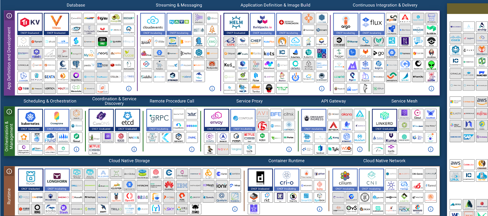

# Delivering more Agile, Resilient and Efficient IT

## What happened after the pandemic

After the pandemic, a new normal sets in. New digital services were delivered quickly during the pandemic. Now we need to focus on stabilizing and slowing down. CEO priority shits to stability instead
of growth.

How do we give the leaders confidence? The things we deliver need to be backed up by stable platforms. How can you be resilient, efficient _and_ agile?!

Let's take a step back and look at when things were less agile. This was when we built monoliths. They were stable, but very difficult to change. To _fix_ that, we moved to smaller services, containers,
all the cool things to make change easier. This is the result..

This landscape is driven by "I'll just build it myself". When you build a tool, it's designed for a specific purpose. You have blind spots.
